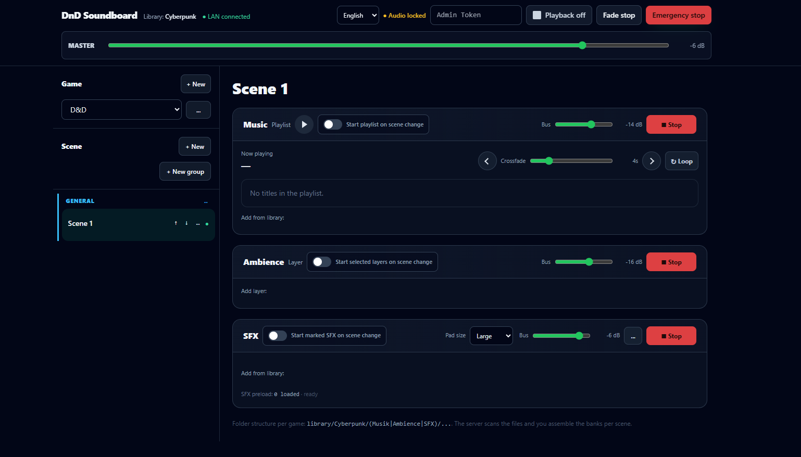

# DnD Soundboard

A browser-based soundboard for tabletop role-playing sessions with music playlists, ambience layers, and instantly triggered SFX pads.



## Version

**Current: 0.5.0**

0.5.0 — Adds Random, Round Robin, and Hold SFX modes, configurable asset pools, improved scene automation, persistent pad-menu state, and restoration of the active game and session after refresh.

See [Release Notes 0.5.0](RELEASE_NOTES_0.5.0.md) for the complete change list.

## Features

- Music playlists with crossfade and track or playlist looping
- Multiple ambience layers with independent volume and fade controls
- Customizable SFX pads with colors, labels, hotkeys, gain, and playback modes
- SFX modes: Poly, Toggle, Restart, Loop, Random, Round Robin, and Hold
- Asset pools for Random and Round Robin variations
- Scenes and sessions for organizing complete game setups
- Scene-change automation for Music, Ambience, and SFX
- German and English localization
- Browser-based audio mixing with master, bus, layer, pad, and voice-ducking controls
- LAN-ready server with SQLite persistence

## Requirements

- Python 3.10 or newer
- A modern browser with Web Audio API support
- Dependencies listed:
  - FastAPI
  - Uvicorn

## Installation

```bash
git clone https://github.com/floriandvv/Soundboard.git
cd Soundboard

python3 -m venv .venv
source .venv/bin/activate
```

On Windows PowerShell:

```powershell
py -m venv .venv
.venv\Scripts\Activate.ps1
```

## Setup

The server expects the following structure:

```text
.
├── soundboard-server.py
├── ui-dist
    ├── index.html
    └── favicon.png
├── locale
    ├── de.json
    └── en.json
└── library/
    └── My Campaign/
        ├── Musik/
        ├── Ambience/
        └── SFX/
```

Copy the UI files into the configured UI directory:

```bash
mkdir -p ui-dist/locale
cp index.html favicon.png ui-dist/
cp de.json en.json ui-dist/locale/
```

Create or edit `.env` if needed. The default configuration uses `./library`, `./soundboard.db`, and port `8000`.

## Run

```bash
python3 soundboard-server.py
```

Open [http://127.0.0.1:8000](http://127.0.0.1:8000). To use the soundboard from another device on the same LAN, open `http://<server-ip>:8000`.

Click **Enable audio** in the browser before playback.

## Supported audio formats

`.mp3`, `.wav`, `.ogg`, `.opus`, `.flac`, `.m4a`, and `.aac`

## Configuration

Important environment variables:

| Variable | Default | Description |
|---|---|---|
| `SOUNDBOARD_GAMES_DIR` | `./library` | Audio library root |
| `SOUNDBOARD_DB` | `./soundboard.db` | SQLite database path |
| `SOUNDBOARD_UI_DIR` | `./ui-dist` | Served UI directory |
| `SOUNDBOARD_HOST` | `0.0.0.0` | Bind address |
| `SOUNDBOARD_PORT` | `8000` | HTTP port |
| `SOUNDBOARD_LANGUAGE` | `de` | Default UI language: `de` or `en` |
| `SOUNDBOARD_ADMIN_TOKEN` | empty | Optional protection for write requests |

## Security

This project is intended for trusted LAN use. Set an admin token and restrict CORS origins before exposing it beyond a trusted network. Do not commit `.env`, audio libraries, logs, or the SQLite database.
